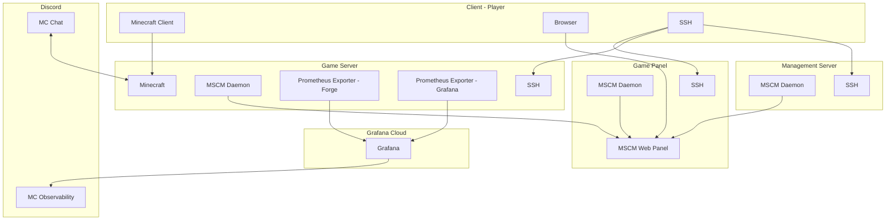

<h1>Introduction</h1>

<p>

</p>

My Minecraft journey started back in University when "Alpha" was released. Considering the 10$ I paid for the license back then has been valid for over a decade, I'd say it has been probably the best return-on-investment in terms of gaming spend over the years. I've been playing on and off since then, and have always been interested in the technical side of the game. I've run my own servers, and have been a part of many others. 

Recently a group of friends decided they wanted to start a new server. Initially one of them paid a hosting service to run the server. However, I quickly remembered going through the administration that there was nothing inherently that we couldn't do ourselves. The main issues previously were more along the lines of internet bandwidth and stability. I had run a server on my own dedicated hardware locally, however the residential internet connection was not ideal, especially with multiple people connecting from different locations across the globe.

Around this time I stumbled on to an interesting blog post by Oracle - [Setting up a really powerful free Minecraft server in the cloud](https://blogs.oracle.com/developers/post/how-to-set-up-and-run-a-really-powerful-free-minecraft-server-in-the-cloud), and I knew I was going to go down the rabbit hole.

My own journey in tech has evolved since the previous local servers, and I wanted to introduce some more modern concepts, while also making it more "production ready" to my standards. Essentially, I wanted to emulate the same infrastructure and features that my friend was currently paying for, and see just how far we could go, while keeping the core concept of remaining free. There are a few blog posts worth of content I plan on writing but to cut the suspense right away - we got pretty darn far, even moving past some of the functionality that the paid service offered.



Let's dive into it and see how we setup a production-grade Minecraft server in the cloud!

<h1>How This Started</h1>

Before we dive into the specifics, let's outline what the goal was. Our current server was running a hefty modpack - All The Mods 9 ([ATM9](https://www.curseforge.com/minecraft/modpacks/all-the-mods-9)). This is a kitchen-sink modpack, with over 400 mods. It's a lot of fun, but it's also very resource intensive. The paid server was running on a 12GB RAM, 4 vCPU instance. The goal was to match this, and see if we could go further.

I had a few goals in mind (and a few stretch ideas at this point):

* Separate the Minecraft server from the rest of the infrastructure as much as possible, isolate it from the management components.
* Setup a web interface to manage the server, including starting/stopping, backups, and other administrative tasks.
* Since our group's main communication channel is Discord, I wanted to integrate the server with Discord, so that we could get notifications and interact with the server from Discord.
* Build in some observation and monitoring tools, so that we could see how the server was performing, and if there were any issues. During the hosted setup, we ran into an unfortunate "automation gone wrong" situation where entity generation ran amuck causing the server to crash (and ultimately some drastic actions to be taken administratively - i.e. deleting chunks). I wanted to be able to catch these issues before they became a problem, and trace where potential issues were stemming from.

All this keeping the mindset of "free"!

<h1>Oracle Cloud Infrastructure</h1>

As part of the free-tier of OCI, I had access to two smaller compute instances as well as a third ARM-based instance highlighted in the Oracle blog post. The plan was to use the ARM instance as the Minecraft server, and the two x86 instances as the management components. 

Following the blog post, I setup the ARM instance with the following specs:

<p>

</p>

Already we're off to a good start, with 24GB of RAM and 8 vCPUs. This is already double the specs of the paid server. I did things a bit out of order at this point but I wanted to make sure I could start the modded server on an ARM architecture. After installing the required dependencies, I was able to start the server and connect to it without an issue. Great! So the core functionality works, let's look at the management components.

<h1>Web Management - MCSManager</h1>

There are a few different Minecraft management consoles available online. I took a look at a few of them, and ended up settling on [MCSManager](https://mcsmanager.com/). It's a NodeJS application, and has a lot of the features I was looking for. It's also open-source, which is always a plus. 

MCSManager has a few different components, including a daemon and a web-component. The web-component is only required on the instance we want to access the management console from, however every instance that will be running a Minecraft server will need the daemon installed. Following the installation instructions, I was able to get the daemon installed and running without an issue on both the ARM and x86 instances.

The specs for this second instance were:

<p>

</p>

I was a little worried that it would not be powerful enough to run the management console, but I figured I'd give it a shot. I installed NodeJS and the required dependencies, and started the application. It started up without an issue, and I was able to connect to it from my browser (after a few changes to the network configuration mentioned in the next section). 

<p>

</p>

<h1>Network Connectivity</h1>

Reading along with this blog you may have noticed that I've been a bit vague about the network configuration so far. This is because I wanted to cover it in a bit more detail here. While not complicated, it wasn't initially obvious and took a bit of document searching to get what I needed accomplished.

<h2>OCI Security Lists</h2>

The first thing needed was to make sure during the OCI provisioning you had access to the instances via SSH. If you followed the default configurations it should have generated a keypair for you, and you should have access to the instances via SSH.

This is great, but we need to configure the security lists to allow access, both from the virtual network configurations in OCI, but also from the instances themselves.

From the OCI console, this was done by going to the Security List Details in the VCN configuration, and adding the following rules:

<p>

</p>

You'll notice a few extra rules here, while not initially required, I'm giving a sneak preview to some of the other components we'll be adding later on. The main thing to note here is that we're allowing access to the MC port, the MCSManager web port, and daemon port. There will be more ports added later on, but this is the minimum required to get the initial configuration setup.


<h2>Instance Firewall</h2>

The next step is to configure the firewall on the instances themselves. This is done differently for the ARM/x86 instances as they use different firewalls. Thankfully, Oracle had another [blog](https://blogs.oracle.com/developers/post/enabling-network-traffic-to-ubuntu-images-in-oracle-cloud-infrastructure) clearly outlining the steps required to update iptables:

Within `/etc/iptables/rules.v4` add the following lines:

```bash
-A INPUT -p tcp -m state --state NEW -m tcp --dport 25565 -j ACCEPT
-A INPUT -p tcp -m state --state NEW -m tcp --dport 80 -j ACCEPT
-A INPUT -p tcp -m state --state NEW -m tcp --dport 24444 -j ACCEPT
-A INPUT -p tcp -m state --state NEW -m tcp --dport 23333 -j ACCEPT
-A INPUT -p tcp -m state --state NEW -m tcp --dport 8081 -j ACCEPT
-A INPUT -p tcp -m state --state NEW -m tcp --dport 8082 -j ACCEPT
```

Followed by reloading the configuration:  `sudo iptables-restore < /etc/iptables/rules.v4`

And for the other instance, we leveraged `firewall-cmd`:

```bash
sudo firewall-cmd --permanent --zone=public --add-port=25565/tcp
sudo firewall-cmd --permanent --zone=public --add-port=24444/tcp
sudo firewall-cmd --permanent --zone=public --add-port=23333/tcp
sudo firewall-cmd --permanent --zone=public --add-port=80/tcp
sudo firewall-cmd --permanent --zone=public --add-port=8081/tcp
sudo firewall-cmd --permanent --zone=public --add-port=8082/tcp
```

Followed by a `sudo firewall-cmd --reload`.

<h1>Minecraft as a Daemon</h1>

Alright, we have the daemon running on both instances, the web management panel running, and the network configured so they can talk to one another. Let's see if we can import the game server daemon into MCSManager.

<h2>Daemon import</h2>

This part was initially trivial. Clicking through the panel to "add daemon" the steps are clear.

<p>

</p>

Using our shell connection on the game server we get the token, add the related details, and the connection worked!

<p>

</p>

You'll notice in the screenshot above the address starts with `wss`. This wasn't initially the case. WSS stands for Web Socket Secure, and is a secure connection. The MCSManager [documentation](https://docs.mcsmanager.com/#/tutorial/reverse-proxy-ssl?id=update-daemon-information) itself suggests NOT using this setup, and initially I did use the regular non-secure setup. However the Security professional in me would not let this stand, and I knew I was going to go down this route eventually.

<h2>Adding the Minecraft Server</h2>

Adding the Minecraft server was just as easy as adding the daemon. Clicking through the panel to "add server" the steps are a little less clear as there are more options, however still intuitive. From `Applications` we go to `+ Add New Instance` and ended up selecting `MC Java Edition` -> `Upload nothing or choose existing file` since we had already installed the server previously.

I'll omit some of the more instance-specific details as it will come down to the exact configuration you want to run. MCSManager works with both "regular" installs as well as Dockered versions. The main thing to note here is that we're using the daemon we just added and the server jar file we uploaded previously, referencing the appropriate start scripts and locations. Once done, we should be able to simply hit Start and have the instance start up, while having an interactive terminal to the instance itself.

<p>

</p>

The nice part of this console setup is that from this step on, there is little need to access the game server instance directly. We can do everything we need to do from the MCSManager console. We can even upload files to the instance, and edit them directly from the console. I ended up doing this for a lot of the game configuration files, and it worked great. 

At this point we have a fully functional Minecraft server running on OCI, with a management console that we can access from anywhere. There is persistence in the sense that using systemctl, and MCSManager configurations we can have the server start up automatically on reboot, and have the MCSManager daemon start up automatically as well. So far, so good!

With that said, using the default non-secure connections was not ideal, so before wrapping this initial post, let's see how we can improve the security of this setup just a little bit. There are more things that could be done, including locking down the initial access to the instances leveraging bastion hosts, and other security measures, but for now let's just focus on the web and daemon components of MCSManager.

<h1>Stepping up Security</h1>

Reading through the [MCSManager documentation](https://docs.mcsmanager.com/#/tutorial/reverse-proxy-ssl) I was intrigued by adding the reverse proxy and SSL. While I was comfortable with certificates, I had never setup a reverse proxy with NGINX before, so this was a great opportunity to learn something new.

<h2>Reverse Proxy</h2>

First step first, let's get the reverse proxy setup. Again the [MCSManager Revers Proxy](https://docs.mcsmanager.com/#/tutorial/simple-reverse-proxy) documentation made this pretty easy. I ended up using the following configuration:

```nginx
http {

        server {
                 # Web panel public access port
                listen 8081;

                location / {
                        # Local address of web panel
                        proxy_pass http://localhost:23333/;
                        root html;
                        index index.html index.htm;
                        # Some necessary HTTP Header settings
                        proxy_set_header Host localhost;
                        proxy_set_header X-Real-IP $remote_addr;
                        proxy_set_header X-Forwarded-For $proxy_add_x_forwarded_for;
                        proxy_set_header REMOTE-HOST $remote_addr;
                        # Required for Websocket support
                        proxy_set_header Upgrade $http_upgrade;
                        proxy_set_header Connection "upgrade";
                        add_header X-Cache $upstream_cache_status;
                        add_header Cache-Control no-cache;
                        expires -1;
                }
        }
```

Having setup nginx under `systemctl` it was a matter of restarting the service using `systemctl restart nginx` and testing if we could access the web panel under the new port. Success! Ok, now let's see what we can do about securing this a bit more.

<h2>Let's Encrypt</h2>

Let's Encrypt is a free, automated, and open certificate authority (CA), run for the public’s benefit. It is a service provided by the Internet Security Research Group (ISRG) and generally tries to further the security of the internet by providing free certificates. 

The [Let's Encrypt](https://letsencrypt.org/) website has a lot of great information on how to get started but the gist of it is that we can use the `certbot` tool to generate a certificate for our domain. In our case, we'll be using the public IP address of our instance, and the domain name I setup for the instances. 

** Sidenote: This is arguably the only "non-free" aspect of this entire project. I pay for the domain name, but this was something I was already doing overall, so I'm not counting it as a cost for this project since I only added a few DNS A records. This doesn't mean you couldn't do this fully free, as there are dynamic IP DNS solutions available, however since I had access to the domain already, I decided to omit another agent running on the instances.**

I was interested not only in the free certificate, but also in the automatic renewal process. Let's Encrypt certificates are only valid for 90 days, so having an automated process to renew them is a great feature. Having worked with certificates over the last decade, the last thing I want is for an expired certificate to cause an issue. So in addition to the free certificate, the automatic renewal process was something I wanted to make sure worked.

Since we are using NGINX, we can use the NGINX plugin for `certbot` to automatically configure the certificate for us. The [certbot documentation](https://certbot.eff.org/instructions?ws=nginx&os=ubuntufocal) steps us through the command to generate the certificate:

```bash
sudo certbot --nginx
```

At which point I added the DNS and owner information, and the certificate was generated. I had to update the NGINX configuration slightly for the reverse proxy to include the certificate information, but that was it. I was able to access the web panel using the new HTTPS port, and the certificate was valid. 

```nginx
http {

        server {
                 # Web panel public access port
                listen 8081 ssl;
                ssl_certificate /etc/letsencrypt/live/panel.quantumlyconfused.com/fullchain.pem; # managed by Certbot
                ssl_certificate_key /etc/letsencrypt/live/panel.quantumlyconfused.com/privkey.pem; # managed by Certbot
                include /etc/letsencrypt/options-ssl-nginx.conf; # managed by Certbot
                ssl_dhparam /etc/letsencrypt/ssl-dhparams.pem; # managed by Certbot

                location / {
                        # Local address of web panel
                        proxy_pass http://localhost:23333/;
                        root html;
                        index index.html index.htm;
                        # Some necessary HTTP Header settings
                        proxy_set_header Host localhost;
                        proxy_set_header X-Real-IP $remote_addr;
                        proxy_set_header X-Forwarded-For $proxy_add_x_forwarded_for;
                        proxy_set_header REMOTE-HOST $remote_addr;
                        # Required for Websocket support
                        proxy_set_header Upgrade $http_upgrade;
                        proxy_set_header Connection "upgrade";
                        add_header X-Cache $upstream_cache_status;
                        add_header Cache-Control no-cache;
                        expires -1;
                }
        }
```

I then tested the web panel again, and success! We now have a secure connection to the web panel.

<p>

</p>

<h2>Securing the Daemon</h2>

The last step was to secure the daemon itself. All that was required was to add another nginx reverse-proxy for the daemon port, add the certificate information, and lastly update the daemon information (adding in `wss://` to the daemon url) in the MCSManager configuration. 

<p>

</p>

<h2>Certificate Renewal</h2>

Remember these certs are only valid for 90 days. Thankfully, since we are using certbot, there is an automatic renewal process. I tested this by manually running the renewal process, and thankfully the dry-run worked.

```bash
$ sudo certbot renew --dry-run
Saving debug log to /var/log/letsencrypt/letsencrypt.log

- - - - - - - - - - - - - - - - - - - - - - - - - - - - - - - - - - - - - - - -
Processing /etc/letsencrypt/renewal/panel.quantumlyconfused.com.conf
- - - - - - - - - - - - - - - - - - - - - - - - - - - - - - - - - - - - - - - -
Simulating renewal of an existing certificate for panel.quantumlyconfused.com

- - - - - - - - - - - - - - - - - - - - - - - - - - - - - - - - - - - - - - - -
Congratulations, all simulated renewals succeeded:
  /etc/letsencrypt/live/panel.quantumlyconfused.com/fullchain.pem (success)
- - - - - - - - - - - - - - - - - - - - - - - - - - - - - - - - - - - - - - - -
```

<h1>Thoughts & Next Steps</h1>

Let's recap what we've done so far:

* Setup our free-tier instances on OCI
* Installed the Minecraft server on the game instance
* Installed MCSManager on the management instance
* Successfully imported the Minecraft instance to MCSManager
* Configred MCSManager to use a reverse proxy
* Added free Let's Encrypt certificates to secure our setup
* "Operationalized" our components for persistence and availability

That's not a bad start! But, this is just the start. There are a few things we did next for observability, that I will cover in the next post:

* Prometheus and Grafana for monitoring
* Discord Integration for notifications & communications
  * For the MC server (game) communication itself
  * For Grafana monitoring and alerting purposes
* Discord Integration for remote management
  * Running MC server commands directly from Discord chat

This has been a fun project so far, and I'm looking forward to sharing the next steps. I hope you've enjoyed this post, and enjoy the next steps in the journey to Productionizing your Minecraft server!

<p>

</p>

Thanks folks, until next time!